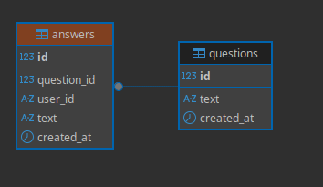

# go-qa-service

RESTful API service for questions and answers built with Go and PostgreSQL.

## Features

- CRUD operations for questions and answers
- Cascading deletion (deleting a question removes all its answers)
- PostgreSQL database with GORM
- Database migrations with goose
- Structured loggingv
- Docker containerization
- Graceful shutdown

## Tech Stack

- **Language**: Go 1.25.4
- **Web Framework**: net/http (standard library)
- **Database**: PostgreSQL 17
- **ORM**: GORM
- **Migrations**: goose
- **Containerization**: Docker, Docker Compose

## Prerequisites

- Docker
- Docker Compose
- Make (optional, for using Makefile commands)

## Quick Start

1. Clone the repository:
```bash
git clone https://github.com/makson2134/go-qa-service
cd go-qa-service
```

2. Create secrets file:
```bash
mkdir -p secrets
echo "your_secure_password" > secrets/postgres-password.txt
```

3. Create `.env` file:
```env
PORT=8080
POSTGRES_USER=qauser
POSTGRES_DB=qaservice
POSTGRES_PORT=5432
```

4. Start the application:
```bash
make up
```

Or manually:
```bash
docker compose up --build
```

The service will be available at `http://localhost:8080`

5. **(Optional)** Customize configuration:
   - Any `.yaml` file in `config/` directory will be loaded
   - Configure server timeouts, connection pool settings, log level, etc.
   - Database connection parameters (host, port, user, database) are set via environment variables

## Makefile Commands

- `make up` - Start application with docker compose (detached mode)
- `make down` - Stop application
- `make build` - Build Go binary to `bin/server`
- `make test` - Run all tests (unit + integration)
- `make test-integration` - Run only integration tests (requires Docker)
- `make migrate-up` - Apply database migrations
- `make migrate-down` - Rollback last migration
- `make logs` - Show application logs (follow mode)
- `make clean` - Stop containers and remove volumes

## API Endpoints

### Health Check

- `GET /health` - Health check endpoint, returns `{"status":"ok"}`

### Questions

- `GET /questions/` - List all questions
- `POST /questions/` - Create a new question
- `GET /questions/{id}` - Get a question with all answers
- `DELETE /questions/{id}` - Delete a question (cascades to answers)

### Answers

- `POST /questions/{id}/answers/` - Add an answer to a question
- `GET /answers/{id}` - Get a specific answer
- `DELETE /answers/{id}` - Delete an answer

## API Examples

### Health check
```bash
curl http://localhost:8080/health
```

### Create a question
```bash
curl -X POST http://localhost:8080/questions/ \
  -H "Content-Type: application/json" \
  -d '{"text": "What is Go?"}'
```

### List all questions
```bash
curl http://localhost:8080/questions/
```

### Get a question with answers
```bash
curl http://localhost:8080/questions/1
```

### Add an answer
```bash
curl -X POST http://localhost:8080/questions/1/answers/ \
  -H "Content-Type: application/json" \
  -d '{"user_id": "user123", "text": "Go is a programming language"}'
```

### Delete a question
```bash
curl -X DELETE http://localhost:8080/questions/1
```

## Database Schema




## Testing

The project includes both unit and integration tests:

- **Unit tests** - Handler validation logic
- **Integration tests** - Database operations with testcontainers

Run all tests:
```bash
make test
```

Or without Make:
```bash
go test -v ./...
```

Run only integration tests (requires Docker):
```bash
make test-integration
```

Or without Make:
```bash
go test -v ./tests/...
```

Integration tests use [testcontainers-go](https://golang.testcontainers.org/) to spin up a real PostgreSQL instance, apply migrations, and verify business logic:
- Multiple answers from the same user on one question
- Cascade deletion of answers when deleting a question

## Database Migrations

Migrations are managed with [goose](https://github.com/pressly/goose) and automatically applied on application startup.

Migration files are located in the `migrations/` directory.
